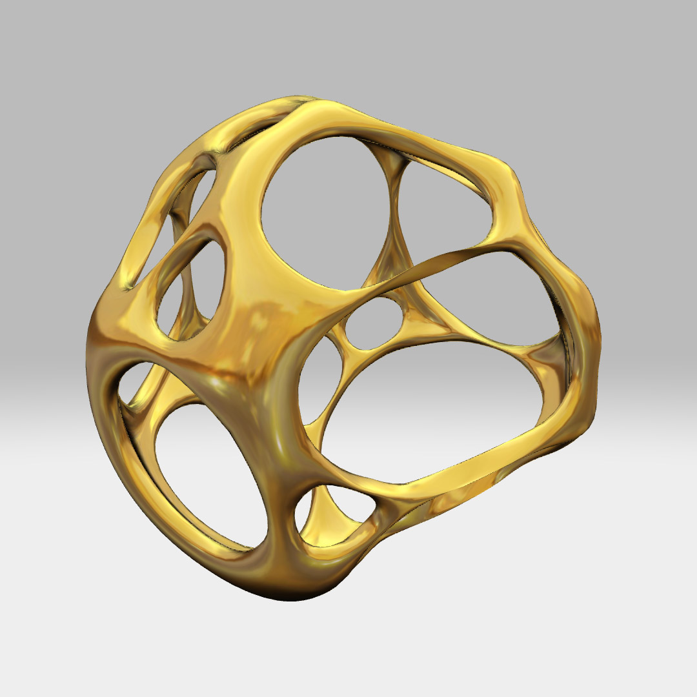
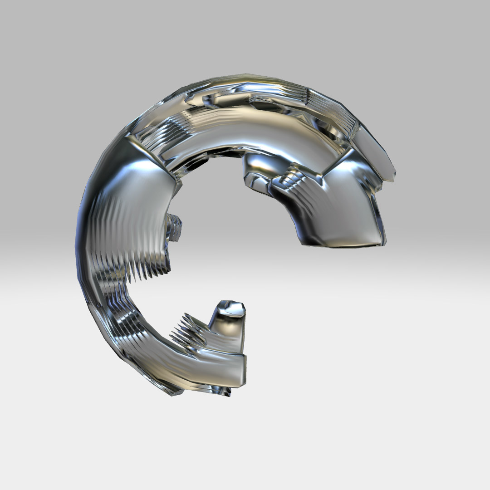
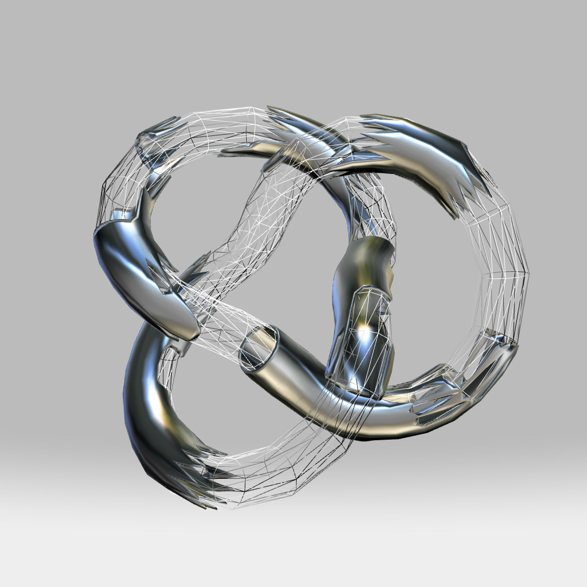

# THREE.ShellModifier
a 'shell' modifier for THREE.js
usage:
```javascript
//shell modifer
var shell = new THREE.ShellModifier();
var geom = shell.modify( geometry, thickness );
```

example: 

* model.html loads a model and applies the shell and smoothing modifiers 


* primitives.html will decimate some triangles from a primitive mesh then perform the shell and smoothing modifiers
with a torus primitive

with a torus knot primitive
